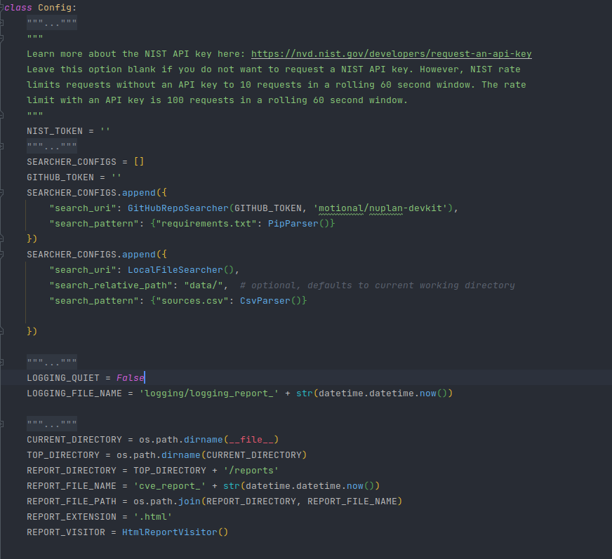
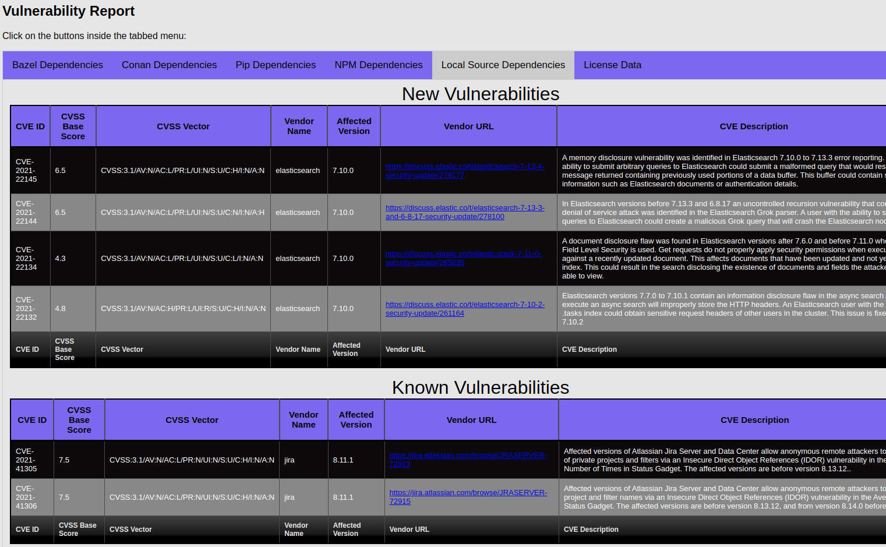

# CVE Tracker
[]()
[]()

CVE Tracker makes it easy to monitor software dependencies for new CVEs in the [National Vulnerability Database](https://nvd.nist.gov/) (NVD).

Dependencies are collected by searching datastores (e.g. a code repository) for files that define project dependencies for common package managers and build systems. The following datastores are supported:

* [GitHub](https://github.com/)
* [GitLab](https://gitlab.com/)
* Local filesystem

Additionally, CVE tracker supports collecting dependencies from files for the following package managers and build systems:

* [Bazel](https://bazel.build/)
* [Conan](https://conan.io/)
* [NPM](https://www.npmjs.com/)
* [PIP](https://pip.pypa.io/)
* [Make](https://www.gnu.org/software/make/manual/make.html)

Additionally, a CSV parser, and JSON parser are available for cases where it is necessary to monitor for CVEs in infrastructure components (e.g. Kubernetes) and dependencies that are in unsupported package manager and build system files.

Once dependencies are collected, CVE Tracker uses the [NIST API](https://nvd.nist.gov/developers/vulnerabilities) to search for relevant CVEs and will generate a report if CVEs are found. If previous reports have been generated, new reports distinguish between CVEs that have been seen in previous reports and those that are new.

## Features
 
* Automatically finds dependency definitions in files stored in [GitHub](https://github.com/), [GitLab](https://gitlab.com/), or the local filesystem
* Supports parsing dependency files in the following formats: `bazel`, `conan`, `pip`, `npm`, `json`, `.mk`, and `csv`
* Automatically finds license data for dependencies
* Relies on the [NIST API](https://nvd.nist.gov/developers/vulnerabilities) as an accurate source of current CVE data
* Supports HTML and JSON reports
* Optionally sends email notifications when new CVEs are found

## Install

CVE Tracker requires Python 3.8 or newer.

To install dependencies:

`pip3 install -r requirements.txt`

You can run all unit tests to check functionality with the following command:

`python3 -m unittest discover`

## Usage

After installing CVE tracker, you must create a configuration file to capture what datastores to search for which file types, what type of report to generate, what type of notification to issue when new CVEs are found, and other related points. You can learn more by reading the documentation in [config.py](config/config.py), which is where you need to set your preferred configuration.

### Config Example



Once you have filled out the configuration file, simply run `./run.py` to automatically collect dependencies and 
generate a report of their CVEs. We recommend creating a cron job or similar to run this command daily to stay apprised of new CVEs in your supply chain.

*Note: The `cve_tracker` is designed to be invoked from the cve_tracker folder, attempting to invoke the tool from another location will result in the tool not  working correctly.*

*Additional Note: The `previous_cves.dat` file generated after the first run keeps track of what CVE IDs have appeared in prior reports.*


### Using CSV Files

If you are using a CSV file to monitor infrastructure components or dependencies in unsupported package manager or build system files, the CSV must contain three columns with the following header: `modulename,version,license`. Use the `license` column to capture the software license. The following CSV file can be used to monitor BitBucket version 6.2 and Kubernetes version 1.14.6 for CVEs:

```
modulename,version,license
bitbucket,6.2,Proprietary
Kubernetes,1.14.6,Apache 2.0
```

## Report Examples

### HTML Report Example: 


### JSON Report Example:

