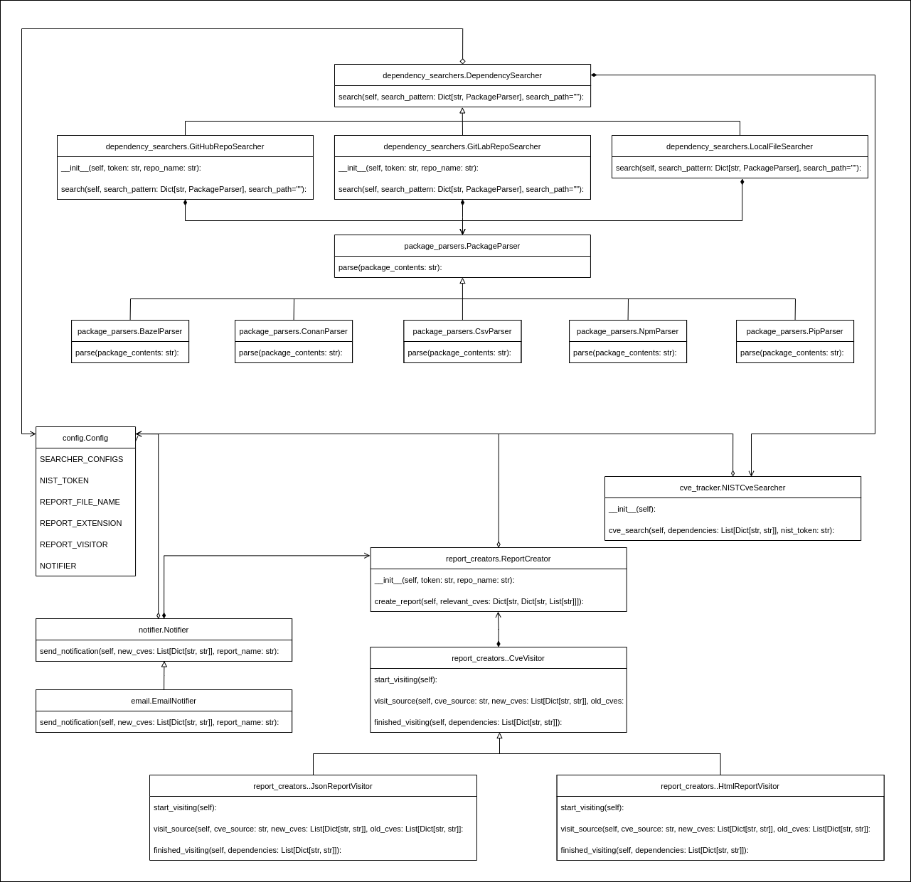

## Architecture

This design is intended to make it easy to add support for additional data stores (searchers), different build system file formats (parsers), and new report formats (report visitors) while maintaining compatability between each. In particular, any searcher should work with any parser, and any parser's results should ultimately lead to CVE results that work with any report visitor.
